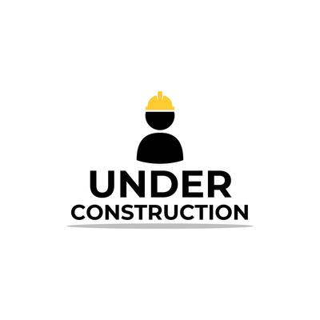

Betaboard is an over-engineered, over-the-top climbing board app. It is very in progress.

 

The goal is to
- Track 3 axes forces applied over climbing holds, and skeletal kinematics of the climber
- 3D visualisation of the forces and climber on the board
- Biomechanics approximations from this time-series data

 
 
 

## Installing

TODO

# Getting Started

TODO

## Usage

TODO

## Contributing

TODO

## Changelog

TODO

## Acknowledgments

TODO

## License

TODO
