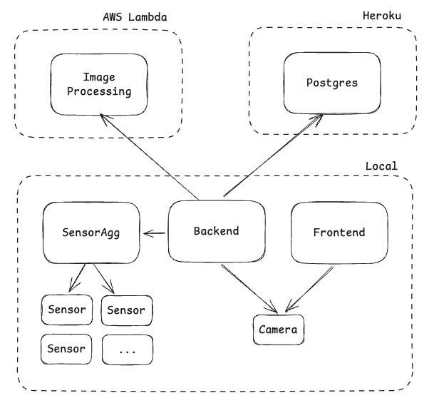

# Architecture

### Frontend

### Backend

### Postgres

### Image Processing

This was broken out from the backend, because the tasks are expensive both in time and compute. This gives this
service deployent unique requirements. Particularly because I wanted to cloud deploy all of this, and I didn't
want to foot the bill for a large EC2.

### SensorAgg

### Sensor

### Camera
